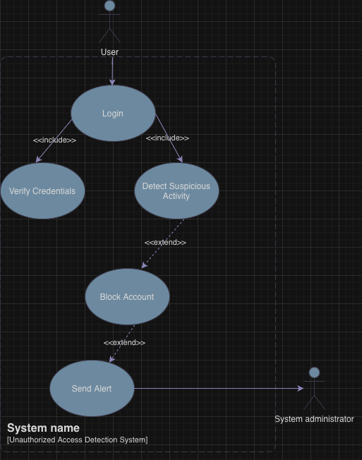
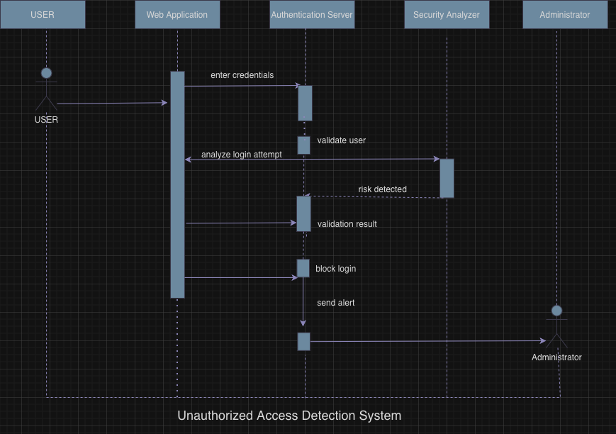
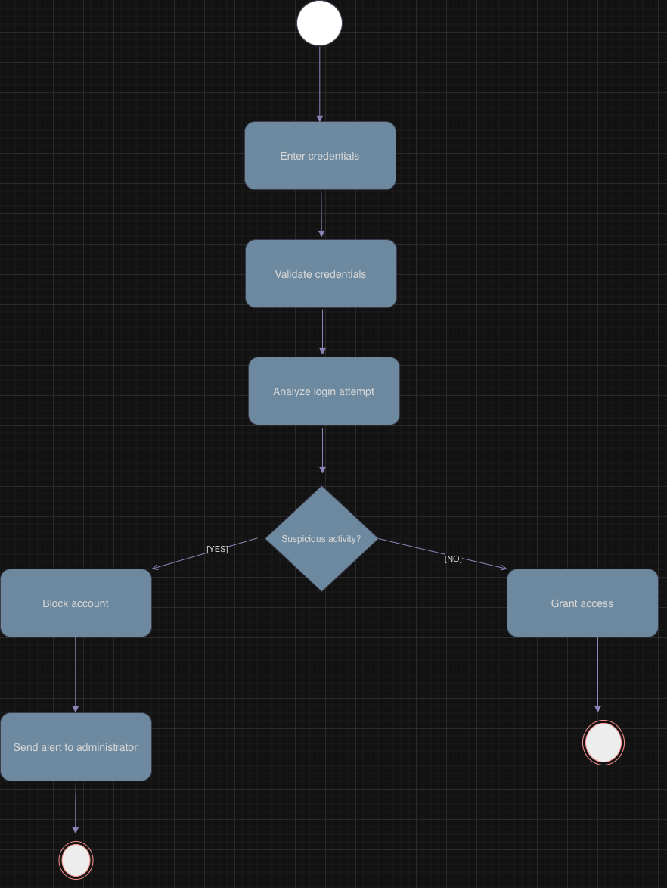

# UML Behavioral Modeling
## Unauthorized Access Detection System

---

## 📌 Project Description

This project demonstrates behavioral UML modeling of a cybersecurity information system designed to detect unauthorized access attempts.

The system analyzes login activity, detects suspicious behavior, blocks unauthorized access and notifies the system administrator.

All diagrams were created using draw.io.

---

## 🧩 Use Case Diagram

### Description
Shows interaction between system actors and available system functionality.

Actors:
- User
- Administrator

---

## 🔄 Sequence Diagram

### Description
Illustrates interaction between system components during authentication.

Flow:
1. User enters credentials
2. Authentication server validates user
3. Security analyzer analyzes login attempt
4. Suspicious activity detected
5. Login blocked
6. Administrator receives alert

---

## ⚙️ Activity Diagram

### Description
Represents workflow logic of authentication and decision-making process.

Possible outcomes:
- Normal login — access granted
- Suspicious activity — account blocked and administrator notified

---

## 📁 Project Files

Repository contains:
- UML diagrams exported as images
- draw.io project file
- Markdown documentation

---

## ✅ Conclusion

All diagrams describe one cybersecurity system from different perspectives:

- Use Case Diagram — system functionality
- Sequence Diagram — interaction between components
- Activity Diagram — workflow logic
